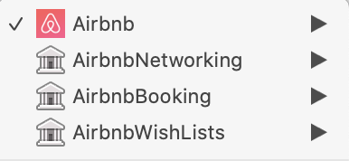
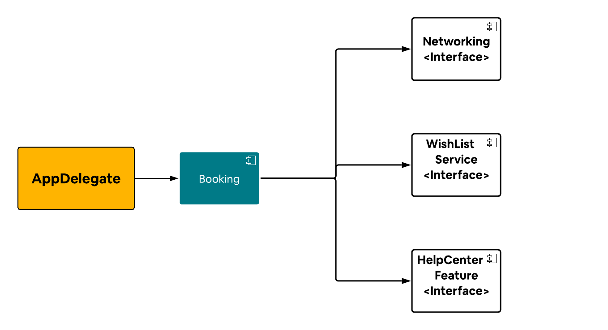

autoscale: true

## Working 
# **effectively**
## at scale

^ My talk is titled

---

# [fit] Francisco 
# [fit] Díaz
### [fit] *franciscodiaz.cl - @fco_diaz*

^ I'm originally from Valdivia, Chile

^ For the locals, that's close to Bariloche

^ I started doing iOS Development in 2011

---

# [fit] *Startups*
### 2011 - 2017

^ Usually working with 1-5 other iOS developers

^ Actually 0-5 other iOS developers

---

# [fit]**Airbnb**
### 2017 - today

^ Almost 3 years ago I moved to San Francisco to work at Airbnb

^ Share my experience

---


^ So what I've been used to, for most of my career is an organization chart that looks something like this

^ Teams for functions

---


^ Part of the iOS team

^ Usually just a couple of people

^ Which sometimes just looked like this

---


^ Moving to Airbnb

---


^ Teams per business

^ You can imagine Homes having a Host subteam / or a guest subteam

---


^ And I work on a sub team of infrastructure, called Native Infra

---


^ and this is just a part of the iOS team

---


^ So, when previously I used to interact with this group

---


^ Now I actually have to interact with these groups

---


---

> organizations ... are constrained to produce designs *which are copies of the communication structures of these organizations*
> --  Conway's law

^ There's a memorable quote by Melvin Conway that says

^ Which basically means that your design will mimic the organization structure

^ The codebase mimics the org structure

---

## How do you 
# [fit] **divide**
## your codebase?

---

**Architectural layer**


^ At startups my usual first approach to an app was to divide based on "layers"

^ I was using an architecture based on Clean Architecture, so you can see the naming convention here

---

**User Flow**


^ The next approach I saw a lot was usually when the codebase started growing 

^ "Per flow"

---

### What about 
# [fit] **Airbnb?**

---


^ As Airbnb grew as a company, the iOS codebase continued growing with it

^ Our first commit was in 2010

^ I love how _all_ data structures were created

---

# [fit] **1 million lines**
### of Swift

^ And now, to date, we have 1 million lines of code

---

## *~80 commits*
#### on any given day to the repo (Android + iOS)

^ with around 100 commits per day

---

# Bigger 
### **buckets**

---



^ So we've been kinda following both patterns at the same time

^ Or, we followed one pattern at a time and now we ended up with both? Who knows!

^ Let's think about this use case

---

## A user should be able to **wishlist a listing from the booking flow**

---

### How do they
# [fit] **relate** 
### with each other?

^ As I pointed out before, the code starts resembling the organization

^ So what is Airbnb Booking and how does it look like?

---


^ We can imagine these 3 dependencies playing together like this

^ But there are more features

---


---


^ When we modify Networking, rebuilding the whole app

---

# [fit]**50 min**
#### local clean builds

^ So let's clarify what this means

^ When you make a change to the app, before you can build the app and run in the simulator, you have to wait 50 minutes

^ We reduced this significantly by having faster machines, which got us part of the way there

^ We started doing 2 things:

---

# [fit]*~30 min*
## 💻

---

# [fit] Buck
## [fit] **HTTP Cache**

###### [https://github.com/airbnb/BuckSample](https://github.com/airbnb/BuckSample)

^ And second, we moved to Buck

^ This was not the only reason why we moved to Buck

^ Buck also has an HTTP cache that makes our local builds much, much faster

^ But that's a talk in itself

^ IMPORTANT: Human readable

---


^ Buck HTTP cache introduced

^ We went from around 25 mins to 5 mins

^ I was used to pretty small codebases

---

# [fit]*~5 min*
## 🦌

---


^ But that still felt bananas

---


^ There's something inherently wrong here

^ We're depending on a lot of code that we don't need

---

## Dependency **inversion**

^ Yeah, I'm not ready to be totally over Clean Architecture ok?

^ Don't judge me

---

-  *High-level modules should not depend on low-level modules*. Both should depend on abstractions.
- *Abstractions should not depend on details*. Details (concrete implementations) should depend on abstractions.

^ So we added the concept of interface, lightweigh modules

---


^ With this we can go back to our original use case

---

## A user should be able to **wishlist a listing from the booking flow**

^ No need to present WishList screen

---


^ But Booking is actually depending on the whole WishList module

^ It only needs access to the Data Source

---

# *Easy!*
### `WishListDataSource`
### + interface!

^ Well that's easy! We just create a `WishListDataSource` module and an Interface module!

---


^ So we go ahead and create the module

---

### `WishListDataSource`
### *is still visible*

^ But there's nothing preventing your from doing

---


---

# **Socializing**
### *best practices*

---

# 🗣

^ Before it worked by just talking to people

---

## [fit] **+60** 
### iOS developers

^ But when you have 60 iOS Developers...

^ That work in different parts of the organization

---

## [fit] **Automating**
### *best practices*

---

### Groups 
### Modules


---

### Groups 
### Modules
### **Module Types**

---

# [fit] **Module Types**

### Feature + Interface
### Service + Interface

^ There are 2 main module types

---

### *Feature*
## A **screen** or a **flow** in the app

^ A feature is defined as a screen or a flow in the app
^ Typically a product team will start with a single feature module. As they expand and build more features, they will break it into multiple modules

---

### *Service*
## Manage **shared state** or resources

^ Services manage shared state or resources. They provide a limited interface through which their state or resources can be accessed or observed by features or other services.

---


^ Now we have these new buckets

^ How do they communicate between each other?

---


^ And how do we enforce these dependency rules?

---

### How do we 
## enforce these
## [fit] **best practices?**

----

## `/services`
## `/service_interfaces`
## `/features`
## `/feature_interfaces`

^ We create new folders in our repository where these modules live

^ Folder per module type

---

```python
def service_interface(
        name,
        deps):
        
    max_visibility = [
        "//ios/feature_interfaces/...",
        "//ios/features/...",
        "//ios/service_interfaces/...",
        "//ios/services/...",
    ]
```

^ Function defines what a service interface module is

^ Who can depend on my module

^ Makes it visible to these folders

---

```python
service_interface(
    name = "Networking",
    deps = [
        "//ios/service_interfaces/Logging",
    ],
)
```

^ You create a new module by using the function

---

```python
feature(
    name = "Booking",
    deps = [
        "//ios/service_interfaces/Networking",
        "//ios/service_interfaces/WishListService",
    ],
)
```

^ We can describe our feature module like this

---

## iOS Platform

^ This is what we call the iOS Platform

^ We're creating a lot of modules

---

## Module creation
### needs to be *easy*

^ But since we want to recommend a way 

---


^ Lengthy process

^ That output something like this

---


^ This is not sane

^ So we did 2 things

---

# `rake make:module`

^ First, we automated the module creation

---
[.code-highlight: 1-6, 9, 12, 15-18]

```
> Provide the type of module you want to create:
    1: Non Platform
    2: Feature
    3: Feature Interface
    4: Service
    5: Service Interface
4
    
> New module name:
Swiftable

> Provide a high level description of this module:
This is a module to present at Swiftable
```

^ And Buck also gave us another major thing

---

# [fit] Buck
## [fit] **Human readable dependencies**

[https://github.com/airbnb/BuckSample](https://github.com/airbnb/BuckSample)

^ Human readable dependencies

^ More details in the repo

---
[.code-highlight: 6]

```python
feature(
    name = "Booking",
    deps = [
        "//ios/service_interfaces/Networking",
        "//ios/service_interfaces/WishListService",
        "//ios/feature_interfaces/HelpCenter",
    ],
)
```

^ One line change

---


^ The end result

---

### *Feature*
## A **screen** or a **flow** in the app

^ We defined a feature as

---



^ Instead of building the whole app

^ Plug a fake AppDelegate

---


^ But we need to fulfill these dependencies

---


^ Can also Mock what we want

^ This is what we call

---

# [fit] **Dev Apps**

---

# [fit]*~1 min*
## Dev Apps

---

### Big buckets
# [fit] **Small** 
### **playgrounds**

---


^ But there's one thing we haven't talked a about

---

## How do we 
## [fit]**get there?**

^ Before we started this process...

---
 
# [fit] *~100 modules*
### [fit]One module type: `/libraries`

^ One monolithic module type

---

`libraries/AirbnbBooking`
`libraries/AirbnbBusinessTravel`
`libraries/AirbnbHelpCenter`
`libraries/AirbnbListings`
`libraries/AirbnbNetworking`
`libraries/AirbnbWishLists`
`...`

^ Modules with different responsibilities

---

## [fit] *Before iOS Platform*
## `/libraries`

---

## [fit] **On the iOS Platform**

## `/services`
## `/service_interfaces`
## `/features`
## `/feature_interfaces`

^ We want to have people contributing to

^ These folders

---

## How to get 
# [fit] **everybody** 
## [fit] on the iOS Platform?

^ ... One option would be to remove

---

## Remove `libraries/`
## and **start over**

^ We cannot stop development

^ Other teams need to continue working

^ Their priorities are not the same

^ The iOS Platform has stricter visibility rules

---

## 🙅🏻‍♂️

---

## **Progressively** migrate

^ Find a way to progressively migrate

---

# Let's **migrate**
# [fit] `WishLists Data Source`

^ Let's take the example of migrating

---

## [fit] `libraries/WishLists`

^ This was originally in the libraries module type

---


^ Let's remember how this looks

^ This is what the end state would look like

---


^ And as a reminder... this are the iOS Platform visibility rules

---


^ And as a reminder, these are our dependency rules for the platform

---

## What are the
## [fit] **dependency rules**
## for `libraries/`?

^ But what about libraries?

^ Libraries is not included

^ What can libraries depend on?

---


^ If we see our end state we can see two types of dependencies

---

# [fit] Inbound dependencies
# [fit] Outbound dependencies

^ There are 2 type of dependencies that we need to consider

---

# [fit] **Inbound dependencies**
#### Outbound dependencies

---


^ Inbound dependencies are things that depend on WishList Service

---

# [fit] The interface module has
## [fit]**stricter rules**

^ If we apply the same strict rules that we have on the iOS platform

^ Not every implementation detail will be visibile

^ Which means..

---

## Migrate **all** the call sites

^ Update everything in Booking and WishLists modules (and everything else

---

#### As the owner of WishLists
# We **don't control** these

^ We're probably **not familiar** with the usage

---


^ The problem, obviously is that we're **allowing tech debt**

^ So, while we're migrating, we're allowing this

---

# **Calculated**
## tech debt

^ Once Booking moves to the platform, they'll need to update their dependencies

^ We **allow libraries to depend on the iOS platform module types**

---

#### Inbound dependencies
# [fit] **Outbound dependencies**

^ What about outbound dependencies?

---


---

## [fit]**we know our usage** 
## of Networking

^ But we're familiar with how we use this

---

## [fit] We **control our dependencies** 

^ We control what we depend on

---

# [fit] Allow **inbound dependencies** from `libraries/`
# [fit] Don't allow *outbound dependencies* to `libraries/`

^ So we decided to migrate from the bottom up

----

### `libraries/` **has access** to the iOS Platform

---

### The iOS Platform **doesn't have access** to `libraries/`

^ This way the iOS Platform has better boundaries

^ While still keeping a path that's smooth for migration

---

### Code on
## the iOS Platform **has good boundaries**

---

## while we allow for *easier migration*

^ We do this by expandiing our visibility rules for all on platform modules

---

[.code-highlight: 1, 11]

```python
def service_interface(
        name,
        visibility = []):
    max_visibility = [
        "//ios/feature_interfaces/...",
        "//ios/features/...",
        "//ios/service_interfaces/...",
        "//ios/services/...",
    ]

    add_visibility_for_legacy_module_structure(max_visibility)
```

---

[.code-highlight: 2-3]

```python
def add_visibility_for_legacy_module_structure(visibility):
    visibility.extend([
        "//ios/libraries/...",
    ])
```

---

### We started 
# migrating 
#### [fit] **from the bottom up**

^ We own a lot of these dependencies

^ Moved infrastructure modules first

---

## Try it 
# **ourselves**

^ So we were forced to pilot ourselves

^ And then we piloted with feature teams

---

# [fit] **Pilot** 
### with others teams

^ You're probably wondering

---

# Should I **follow** this?

---

### Most likely:
# **NO**

^ As I pointed out at the beggining, each organization will affect the codebase structure

---

### There's no
## *silver bullet*

^ Every org is different
^ This works for Airbnb

---

# **Adapt** 👍

^ I'd recommend you to innovate and adapt these ideas to your organization

---
[.build-lists: true]

## To recap:

1. Document best practices
1. Figure out where you're struggling
1. Automate those best practices

---

# *Gracias!*

##### franciscodiaz.cl/talks
